# ST2DCE - DevOps and Continuous Deployment - Project

#   General Guidelines
The main goal of this project is to build an application and deploy it on a
Docker/Kubernetes infrastructure. It's not a question of development and the
provided application only need to be build and deployed

# Part One – Build and Deploy an application using Docker / Kubernetes and Jenkins pipeline
    
## Draw up a diagram of your solution and describe the target architecture and tool chain you suggest to achieve full continuous deployment of the application.
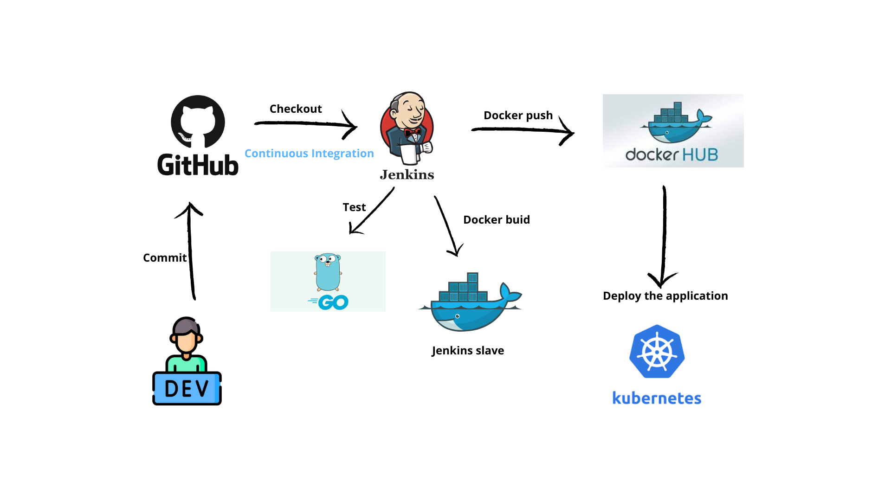
My architecture illustrates an automated workflow for software development and deployment, commonly known as a CI/CD pipeline. Here is a general explanation:

A developer submits code changes to a version control repository, such as GitHub. This trigger initiates an automated process managed by a continuous integration server, like Jenkins, which retrieves the latest code and runs a series of tests to ensure that the changes are sound. Jenkins uses secondary agents to build Docker containers with the updated code.

These containers are then sent to a container registry, such as Docker Hub, where they are stored. Finally, the container orchestration system, Kubernetes, retrieves these container images and deploys them into a production or testing environment, allowing for a rapid and reliable update of the application.

## Customize the application so that the /whoami endpoint displays your team’s name and and deploy it on local docker engine by using Jenkins.
We update the `main.go` file by introducing an additional parameter to the `whomai` type struct, and subsequently, we alter the `whoami` endpoint to reflect this change.
```console
type whoami struct {
	Name  string
	Title string
	Groupe string
	State string
}

func main() {
	request1()
}

func whoAmI(response http.ResponseWriter, r *http.Request) {
	who := []whoami{
		whoami{Name: "Efrei Paris",
			Groupe: "Hitachi",
			Title: "DevOps and Continous Deployment",
			State: "FR",
		},
	}

	json.NewEncoder(response).Encode(who)

	fmt.Println("Endpoint Hit", who)
}
```
To deploy it in our local machine we are created a Dockerfile 
```Dockerfile
FROM golang:latest

RUN mkdir /app

ADD . /app

WORKDIR /app

RUN go build -o main .

EXPOSE 8181

CMD [ "/app/main" ]

```
### Setup minikube and jenkins 
launch minikube by using the command `minikube start`

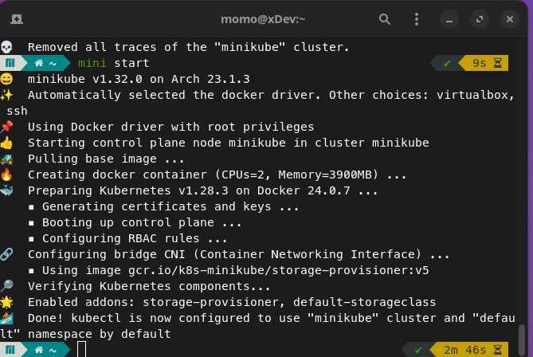

create a volume 
`docker volume create jenkins_volumes`

now execute :
```console
docker run --name jenkins -d -p 8080:8080 -p 50000:50000  -v jenkins_volume:/var/jenkins_home --network minikube jenkins/jenkins:lts
```
and configure the jenkins `http://localhost:8080`
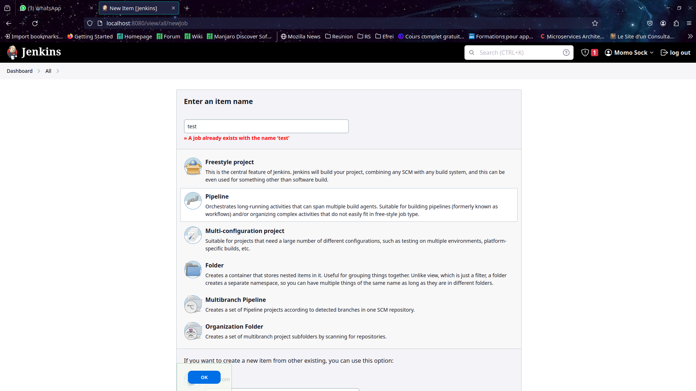
set also the credentials
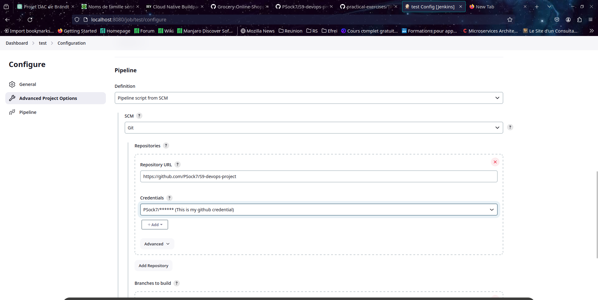
manage node add 
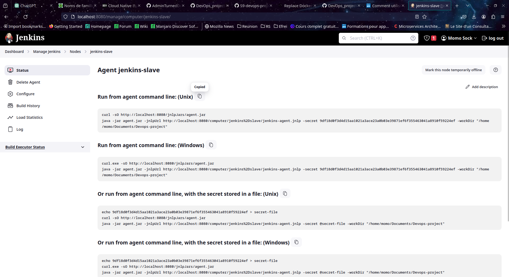
launch slave 
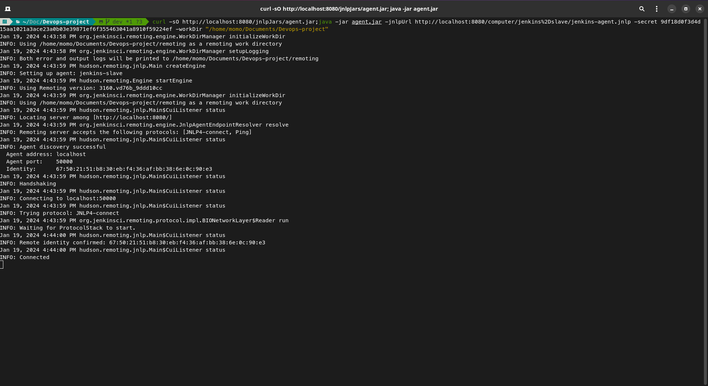

## Deploy app locally using jenkins
we use the docker compose file to run the pipeline
```yaml
pipeline {
    agent {
        label 'jenkins-slave'
    }

    stages {
        stage('Checkout') {
            steps {
                git 'https://github.com/Nelson-Fossi/DevOps_project.git'
            }
        }

        stage('Build and Push Docker Image') {
            steps {
                script {
                    // Adjust Docker commands for Windows
                    sh 'docker-compose build'
                }
            }
        }

        stage('Deploy to Local Docker Engine') {
            steps {
                script {
                    // Adjust Docker commands for Windows
                    sh 'docker-compose up -d'
                }
            }
        }
    }

    post {
        always {
            script {
                // Adjust Docker commands for Windows
                sh 'docker-compose down'
            }
        }
    }
}

```
after launch the test build and :
```console
curl http://localhost:8181/whoami
```
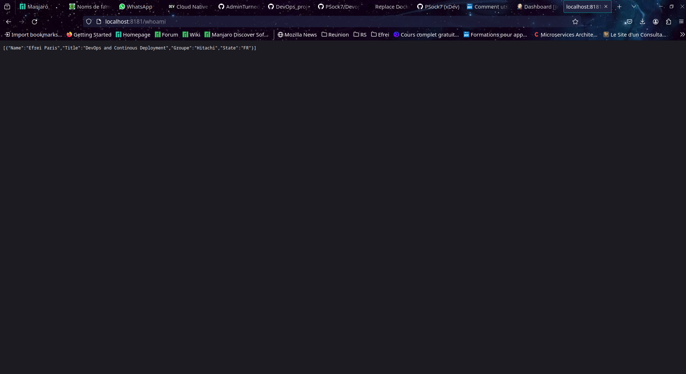

# Update the pipeline to deploy the application on your Kubernetes (Minikube) cluster
#### Add minikube in our jenkins configuration 
Install the kubernetes plugins and to add the minikube go to manage jenkins and clouds and add a new cloud
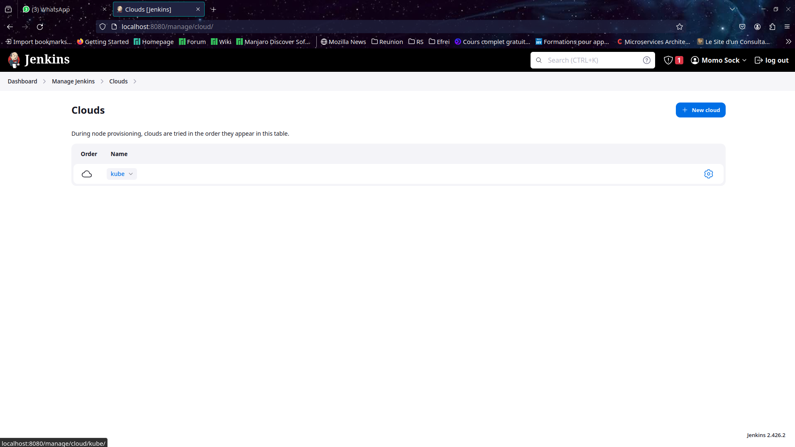
click add and go to the .kube folder and choose the config file
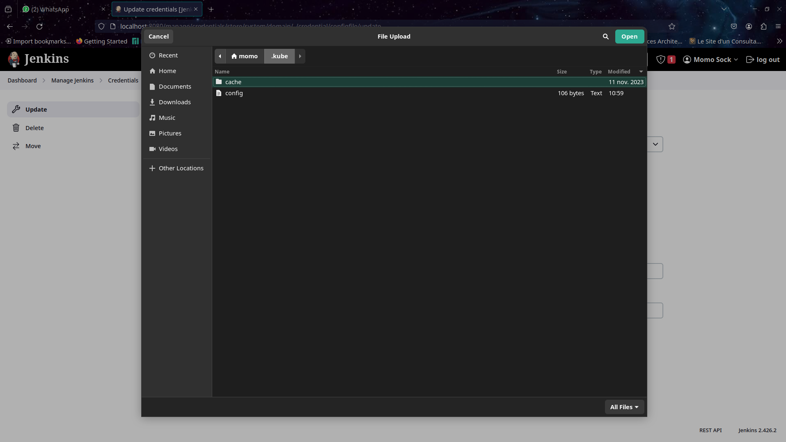
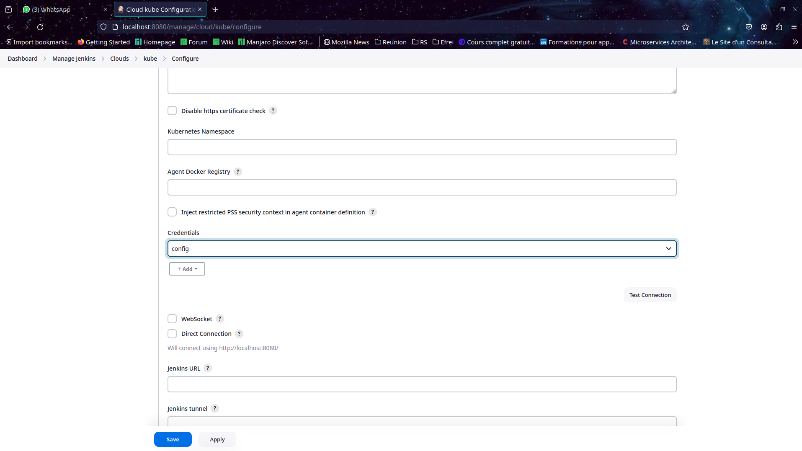
Before saving the information we need to test if the test succeed
#### Set credentials
you need to set up your github credential if you choose pipeline scm instead of pipeline script
to automatically called our jenkinsfile
```console
pipeline {
    agent {
        label 'jenkins-slave'
    }
    environment {
        DOCKERHUB_CREDENTIALS = credentials('devops-cred')
        NEW_IMAGE = "efrei2023/golangwebapi:${BUILD_NUMBER}"
    }
    stages {
        stage('SCM Checkout') {
            steps {
                checkout scm
            }
        }

        stage('Build docker image') {
            steps {
                sh 'docker build -t ${NEW_IMAGE} .'
            }
        }

        stage('Login to Docker Hub') {
            steps {
                withCredentials([usernamePassword(credentialsId: 'devops-cred', passwordVariable: 'DOCKERHUB_PSW', usernameVariable: 'DOCKERHUB_USR')]) {
                    sh 'echo $DOCKERHUB_PSW | docker login -u $DOCKERHUB_USR --password-stdin'
                }
            }
        }

        stage('Push image to Docker Hub') {
            steps {
                sh 'docker push ${NEW_IMAGE}'
            }
        }

        stage('Deploy to Dev Environment') {
            when {
                branch 'dev'
            }
            steps {
                script {
                    sh "sed -i 's|efrei2023/golangwebapi:latest|${NEW_IMAGE}|' ./Kubernetes/dev/go.yaml"
                    sh 'kubectl apply -f ./Kubernetes/namespace.yaml'
                    sh 'kubectl apply -f ./Kubernetes/dev/go.yaml'
                }
            }
        }

        stage('Deploy to Prod Environment') {
            when {
                branch 'prod'
            }
            steps {
                script {
                    sh "sed -i 's|efrei2023/golangwebapi:latest|${NEW_IMAGE}|' ./Kubernetes/prod/go.yaml"
                    sh 'kubectl apply -f ./Kubernetes/namespace.yaml'
                    sh 'kubectl apply -f ./Kubernetes/prod/go.yaml'
                }
            }
        }

    }
    post {
        always {
            sh 'docker logout'
        }
    }
}

```
also you need to set up your docker hub token 
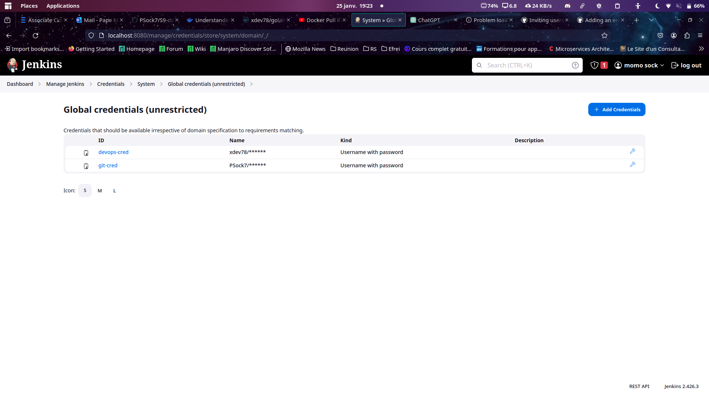
#### Kubernetes file 
We are created two files : 
* namespace.yaml 
```yaml
---
apiVersion: v1
kind: Namespace
metadata:
  name: developpement
  labels:
    name: developpement
...

---
apiVersion: v1
kind: Namespace
metadata:
  name: production
  labels:
    name: production
...

```
* go.yaml
```yaml
---
apiVersion: apps/v1
kind: Deployment
metadata:
  name: gowebapi
  namespace: developpement
spec:
  selector:
    matchLabels:
      app: gowebapi
  replicas: 2
  template:
    metadata:
      labels:
        app: gowebapi
    spec:
      containers:
      - name: gowebapi
        image: efrei2023/golangwebapi:latest
        ports:
        - containerPort: 8181
...
---
apiVersion: v1
kind: Service
metadata:
  name: gowebapi
  namespace: developpement
spec:
  type: LoadBalancer
  selector:
    app: gowebapi
  ports:
    - protocol: TCP
      port: 8181
      targetPort: 8181
```
#### Test Build
After setting up all configuration we start the build
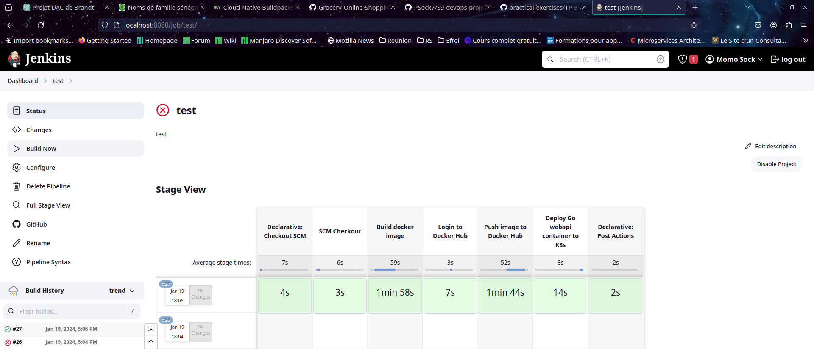
we see in our docker hub the build image
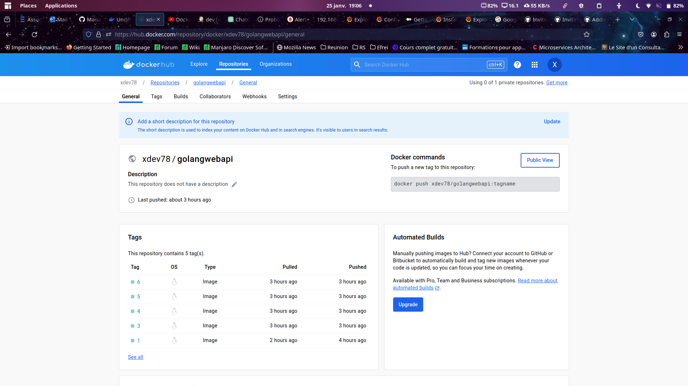
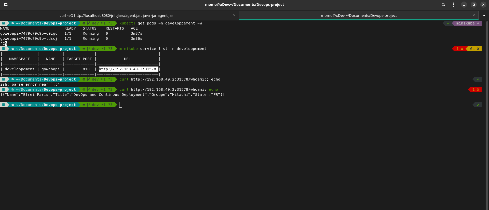
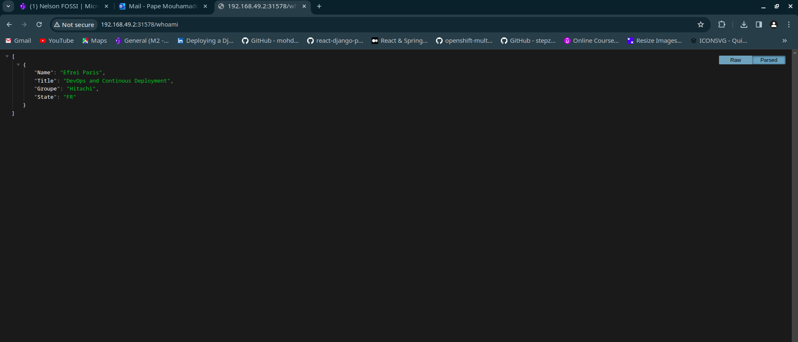

## Build the docker image using the buildpack utility and describe what you observe in comparison with the Dockerfile option
 First we need to install the buildpack utility in our local machine 
```console
(curl -sSL "https://github.com/buildpacks/pack/releases/download/v0.32.1/pack-v0.32.1-linux.tgz" | sudo tar -C /usr/local/bin/ --no-same-owner -xzv pack)
```
use the command `pack builder suggest` that tell you what image would be best to use for your code.
```console 
pack build gocloudpack --builder http://gcr.io/buildpacks/builder:v1 --path .
```
 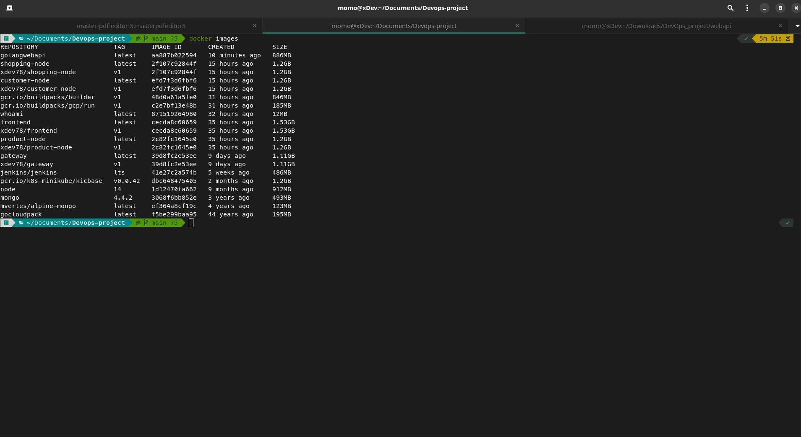
L'image construit avec build pack est plus leger .

```console
docker run -p 8080:8080 -tid gocloudpack
```

use `curl http://localhost:8080/whoami`
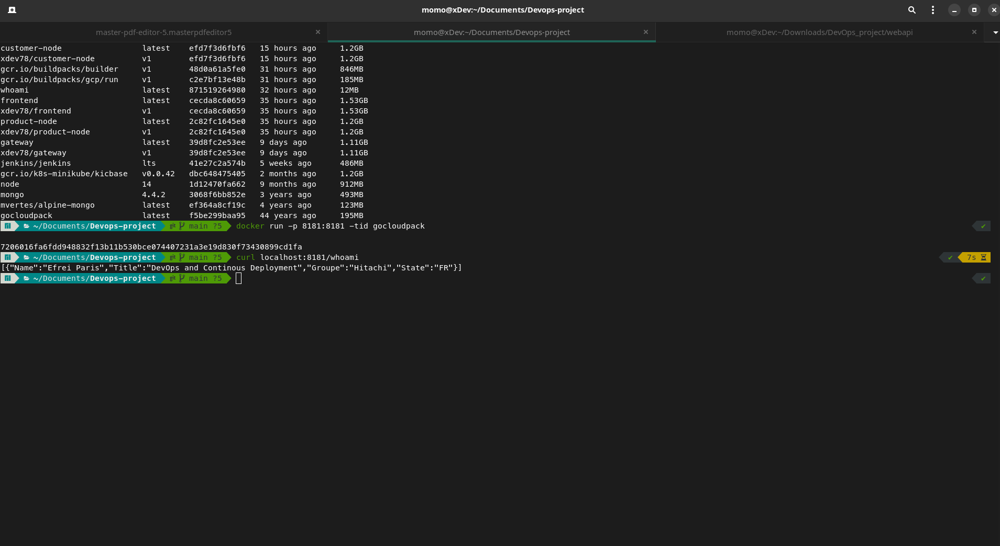

# Part Two – Monitoring and Incident Management for containerized application
- Install and configure Prometheus / Grafana / AlertManager stack
- Install node_exporter and view metrics on Grafana
## Install prometheus using Official Helm Chart ##

Step 1 - Add prometheus repository : 
```console
helm repo add prometheus-community https://prometheus-community.github.io/helm-charts`
```
Step 2 - Install provided Helm chart for Prometheus : 
```console 
helm install prometheus prometheus-community/prometheus
```
Step 3 - Expose the prometheus-server service via NodePort : 
```console 
kubectl expose service prometheus-server --type=NodePort --target-port=9090 --name=prometheus-service
```
Step 4 - Access Prometheus UI : 
```console 
minikube service prometheus-service --url
```
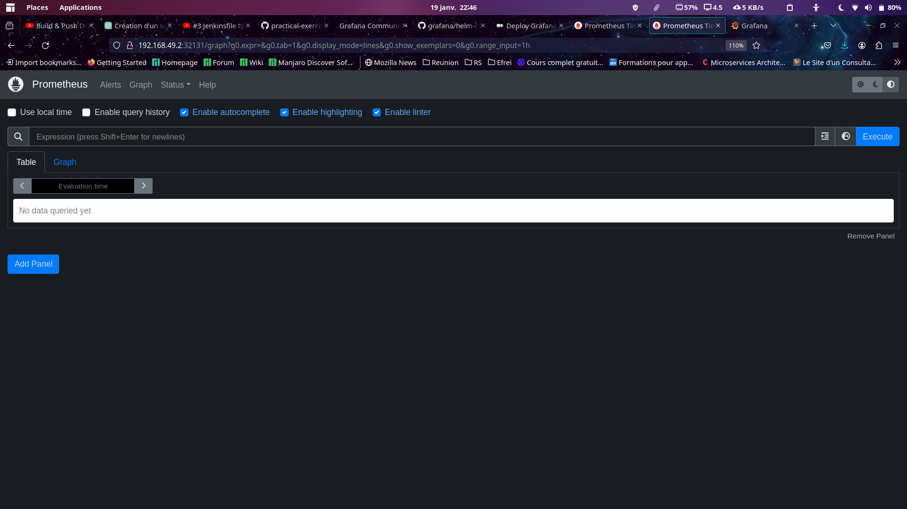

## Repeat steps 1 - 4 for the Grafana component using Official Helm Chart ##

* Grafana Helm repo :  https://grafana.github.io/helm-charts

* Chart name : 'grafana/grafana'. your own password for admin access.
```console
kubectl get secret --namespace default grafana -o jsonpath="{.data.admin-password}" | base64 --decode ; echo 
```

* Expose Grafana service via NodePort in order to access Grafana UI with 
```console
kubectl expose service grafana  --type=NodePort --target-port=3000 --name=grafana-service.
```
* Access Grafana Web UI and configure a datasource with the deployed prometheus service url 
```console
minikube service grafana-service --url
```
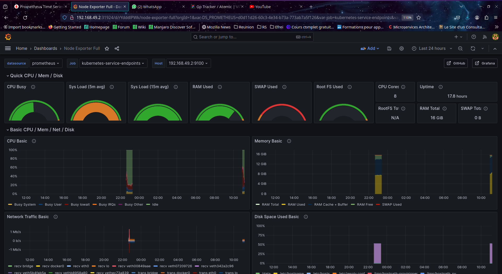
* Install and Explore Node_Exporter Dashborad. ID 1860

## Configure Alert Manager component and setup Alerts
Expose AlertManager service via NodePort in order to access UI with target port 9093
```console
kubectl expose service prometheus-alertmanager --type=NodePort --target-port=9093 --name=alert-service
```
```console 
minikube service alert-service --url 
```
After we configure some alert based on this website :https://samber.github.io/awesome-prometheus-alerts/rules.html#kubernetes
```yaml
serverFiles:
  alerting_rules.yml:
    groups:
      - name: Instances
        rules:
          - alert: InstanceDown
            expr: up == 0
            for: 1m
            labels:
              severity: critical
            annotations:
              description: "{{ $labels.instance }} of job {{ $labels.job }} has been down for more than 1 minutes."
              summary: "Instance {{ $labels.instance }} down"
      - name: low_memory_alert
        rules:
        - alert: LowMemory
          expr: (node_memory_MemAvailable_bytes /  node_memory_MemTotal_bytes) * 100 < 85
          for: 2m
          labels:
            severity: warning
          annotations:
            host: "{{ $labels.kubernetes_node  }}"
            description: "{{ $labels.kubernetes_node }}  node is low on memory.  Only {{ $value }}% left"
            summary: "{{ $labels.kubernetes_node }} Host is low on memory.  Only {{ $value }}% left"
        - alert: KubePersistentVolumeErrors
          expr: kube_persistentvolume_status_phase{job="kubernetes-service-endpoints",phase=~"Failed|Pending"} > 0
          for: 2m
          labels:
            severity: critical
          annotations:
            description: The persistent volume {{ $labels.persistentvolume }} has status {{ $labels.phase }}.
            summary: PersistentVolume is having issues with provisioning.
        - alert: KubePodCrashLooping
          expr: rate(kube_pod_container_status_restarts_total{job="kubernetes-service-endpoints",namespace=~".*"}[5m]) * 60 * 5 > 0
          for: 2m
          labels:
            severity: warning
          annotations:
            description: Pod {{ $labels.namespace }}/{{ $labels.pod }} ({{ $labels.container }}) is restarting {{ printf "%.2f" $value }} times / 5 minutes.
            summary: Pod is crash looping.
        - alert: KubePodNotReady
          expr: sum by(namespace, pod) (max by(namespace, pod) (kube_pod_status_phase{job="kubernetes-service-endpoints",namespace=~".*",phase=~"Pending|Unknown"}) * on(namespace, pod)    group_left(owner_kind) topk by(namespace, pod) (1, max by(namespace, pod, owner_kind) (kube_pod_owner{owner_kind!="Job"}))) > 0
          for: 2m
          labels:
            severity: warning
          annotations:
            description: Pod {{ $labels.namespace }}/{{ $labels.pod }} has been in a non-ready state for longer than 5 minutes.
            summary: Pod has been in a non-ready state for more than 2 minutes.
```
Apply the configuration update with : 
```console
helm upgrade --reuse-values -f prometheus-alerts-rules.yaml prometheus prometheus-community/prometheus
```
## Configure AlertManager to send Alerts by Email ##
We are created and alert manager config file to receive alert by mail
```yaml
alertmanager:
  config:
    global:
      resolve_timeout: 5m
    route:
      group_wait: 20s
      group_interval: 4m
      repeat_interval: 4h
      receiver: 'gmail-notifications'
      routes: []
    receivers:
    - name: 'gmail-notifications'
      email_configs:
      - to: '$receiver'
        from: 'email-k8s-admin@alertmanager.com'
        smarthost: '$smtp_host'
        auth_username: '$smtp_suer'
        auth_password: '$smtp_pass'
        auth_identity: '$email'
        send_resolved: true
        headers:
         subject: " Prometheus -  Alert Team Hitachi"
        text: "{{ range .Alerts }} Hi, \n{{ .Annotations.summary }}  \n {{ .Annotations.description }} {{end}} "
```
```console
   helm upgrade --reuse-values -f alertmanager-config.yaml prometheus prometheus-community/prometheus
```
## Bonus (+1): Configure another alert and send it by e-mail to abdoul-aziz.zakari-madougou@intervenants.efrei.net.
we change the receiver from the alertmanager and use
```console
   helm upgrade --reuse-values -f alertmanager-config.yaml prometheus prometheus-community/prometheus
```
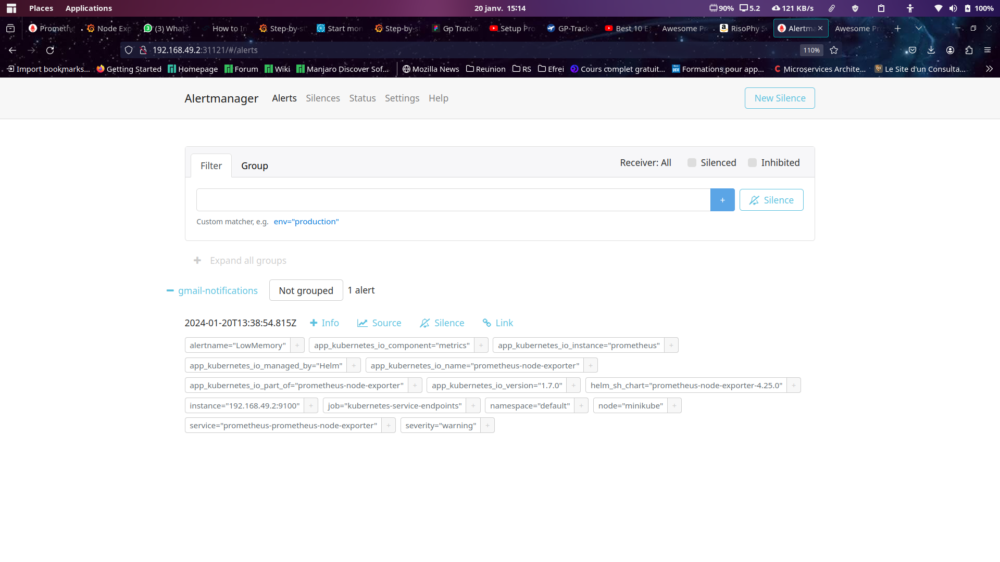
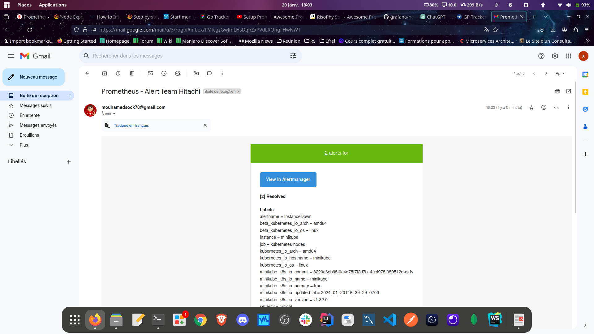
# Logs Management
Install the component by using the  Helm chart provided by grafana :

```console
helm upgrade --install loki grafana/loki-stack --set promtail.enabled=false  --set grafana.enabled=false
```
Expose Loki service via NodePort in order to access UI with target port 3100 : 
```console 
kubectl expose service loki --type=NodePort --target-port=3100 --name=loki-service
```